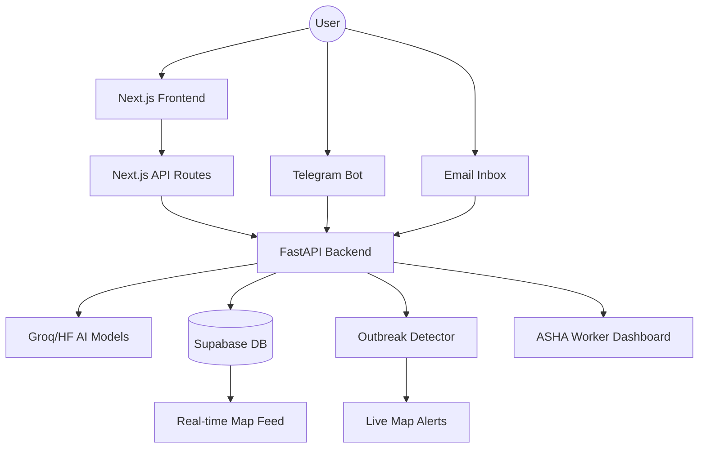

# 🏥 ArogyaMap: Community-Driven Disease Intelligence

ArogyaMap is a professional, multi-channel public health intelligence platform designed to track disease symptoms in real-time and provide early warning signals to health workers and the community.

## 🌟 The Core Idea
In many regions (like Kerala), early detection of disease outbreaks often relies on manual reports or hospital admissions. **ArogyaMap** democratizes this by allowing citizens to report symptoms—via voice, text, or photo—anonymously.

By aggregating these reports with AI-driven triage and location data, the system identifies "hotspots" or clusters before they become full-blown epidemics, and alerts ASHA (Accredited Social Health Activist) workers immediately.

---

## 🛠️ Technology Stack

### **Frontend (The Command Center)**
- **Next.js 14**: Modern server-side rendered React framework for high performance.
- **Tailwind CSS**: Utility-first styling with a premium glassmorphic dark theme.
- **Leaflet.js**: High-performance interactive map for real-time spatial intelligence.
- **Lucide React**: Professional vector-based iconography.
- **Chart.js**: Dynamic data visualization for district-wise risk scores and epidemic curves.

### **Backend (The Intelligence Engine)**
- **FastAPI (Python)**: High-performance asynchronous API framework.
- **APScheduler**: Automated background jobs for outbreak detection and automated patient follow-ups.
- **Groq & HuggingFace**: Large Language Models (LLMs) and acoustic models used for:
  - **Symptom Triage**: Analyzing text/voice to determine urgency.
  - **Cough Analysis**: Identifying potential respiratory distress from audio.
  - **Visual Triage**: Analyzing photos of rashes or symptoms.

### **Data & Real-time Persistence**
- **Supabase (PostgreSQL)**: Robust database layer with real-time row-level security.
- **Real-time Subscriptions**: Map dots pop up the instant a report is submitted without page refreshes.

---

## 📡 Multi-Channel Reporting
ArogyaMap is accessible to everyone, regardless of their tech proficiency:
1.  **Web Portal**: Professional mobile-responsive form with voice recording and camera support.
2.  **Telegram Bot**: Interactive bot for reporting symptoms, sharing location, and receiving voice-based medical advice.
3.  **Email Proxy**: Automatic polling of reports sent via email for offline integration.

---

## 🏗️ Project Architecture

---

## 📈 Key Features

### **1. AI-Driven Triage**
Automatically categorizes reports into **High, Medium, or Low** urgency based on the severity of symptoms described in voice or text.

### **2. Spatial Outbreak Detection**
A greedy clustering algorithm monitors new reports. If multiple high-urgency reports (e.g., "High fever and chills") appear within a 2km radius, the system triggers a **Red Alert Banner** on the live map.

### **3. Optimized Nursing/ASHA Route**
ASHA workers can see a table of patients in their zone sorted by urgency. The system can **optimise a visit route** using a nearest-neighbor algorithm to ensure critical cases are seen first.

### **4. Community Feedback Loop**
The system automatically schedules a **24-hour follow-up** via Telegram to ask the user if they are feeling better, helping track the recovery rate of a neighborhood.

---

## 🛡️ Privacy & Security
- **Strict Anonymity**: No PII (Personally Identifiable Information) is stored.
- **Coordinate Rounding**: GPS locations are rounded to a 500m grid before being displayed on the map to prevent "house-level" identification.
- **Local Persistence**: Environment variables and keys are managed securely in separate server environments.

---

*Built for a healthier, more connected community.*
